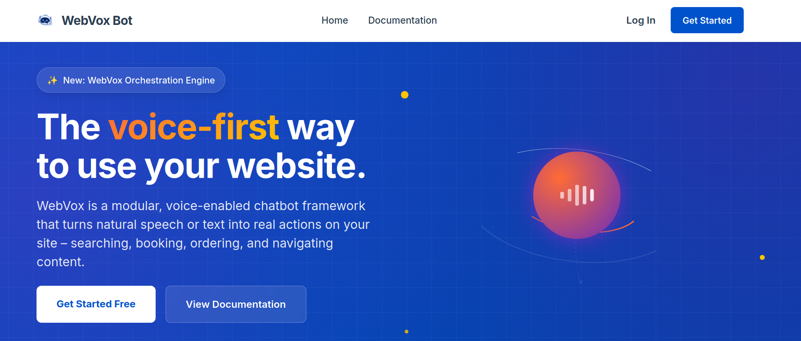
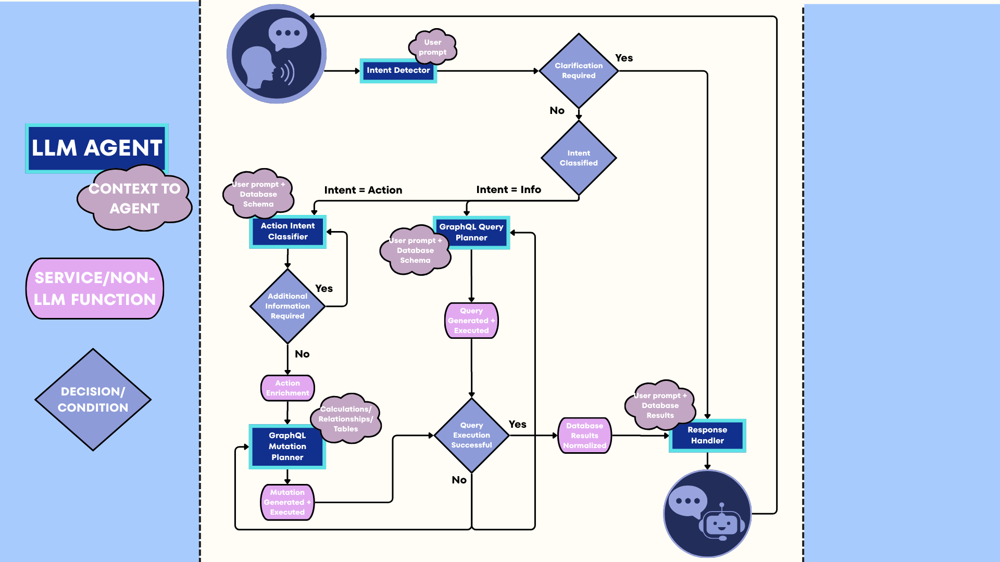

<p align="center">
  
</p>

<p align="center">
  
  
  
  
  
</p>

<br/>

# WebVox — Intelligent Voice-Driven Chatbot Framework

WebVox is an open-source, API-first framework for building intelligent voice and text chatbots that integrate large language models (LLMs) with both structured (relational/GraphQL) and unstructured (document/PDF) data retrieval. Unlike rigid, all-in-one chatbot products, WebVox is designed to be embedded into existing websites and applications via its API layer — giving development teams full control over behavior, data sources, and deployment.

---

## Table of Contents

- [Overview](#overview)
- [Key Features](#key-features)
- [Architecture](#architecture)
- [Tech Stack](#tech-stack)
- [Project Structure](#project-structure)
- [Prerequisites](#prerequisites)
- [Installation & Setup](#installation--setup)
  - [1. Clone the Repository](#1-clone-the-repository)
  - [2. Set Up the Python Environment](#2-set-up-the-python-environment)
  - [3. Configure Environment Variables](#3-configure-environment-variables)
  - [4. Configure the Application](#4-configure-the-application)
  - [5. Start the GraphQL Layer (Hasura + Postgres)](#5-start-the-graphql-layer-hasura--postgres)
  - [6. Ingest the Static Knowledge Base](#6-ingest-the-static-knowledge-base)
  - [7. Run the Backend](#7-run-the-backend)
  - [8. Run the Frontend](#8-run-the-frontend)
- [Configuration Reference](#configuration-reference)
- [Makefile Commands](#makefile-commands)
- [Services & Modules](#services--modules)
- [RAG Pipeline](#rag-pipeline)
- [Voice Processing](#voice-processing)
- [Data Layer](#data-layer)
- [Roadmap / Known Limitations](#roadmap--known-limitations)
- [Contributing](#contributing)
- [License](#license)

---

## Overview

WebVox enables businesses to add a smart assistant to their website that can:

- Answer questions by searching a **static knowledge base** (PDFs, documents) using vector similarity search.
- Query **live relational data** (e.g. orders, products, policies) through a **GraphQL/Hasura layer** on top of a Postgres database.
- Accept input via **voice** (Azure Cognitive Services speech-to-text and text-to-speech) or text.
- Support **multiple languages** via automatic translation.
- Maintain **session context** and perform multi-turn conversations.
- Detect user **intent** and ask for clarification when confidence is low.

The system is built around a **Retrieval-Augmented Generation (RAG)** pipeline: user queries are first routed to the most relevant data source(s), context is retrieved, and then an LLM generates a natural language response grounded in that context.

---

## Key Features

- **Framework-first design** — delivered as API endpoints, not a locked-down SaaS product.
- **Dual retrieval modes** — static knowledge base (FAISS vector search over PDFs/docs) and dynamic database queries (GraphQL via Hasura or Directus).
- **Voice support** — Azure Cognitive Services for speech input and output; audio transcribed and processed server-side.
- **Intent detection** — confidence scoring, clarification prompts, and multi-attempt resolution before fallback.
- **Multi-language** — deep-translator integration for query/response translation.
- **Session security** — dedicated session security service for multi-user isolation.
- **LLM-agnostic** — currently supports Groq (LLaMA / GPT-style models) and Google Gemini, configurable via YAML.
- **Schema-aware GraphQL** — the system introspects your database schema and caches descriptions to avoid redundant LLM calls, then generates and executes GraphQL queries on the fly.
- **PII protection** — configurable list of fields that are never surfaced in responses.
- **Vector caching with TTL** — FAISS-backed cache for dynamic query results with configurable expiry per data type.
- **Configurable via YAML** — all behaviour (chunking, similarity thresholds, RAG sources, fallback messages, etc.) controlled from `config.yaml`.

---

## Architecture

<p align="center">
  
  <br/>
  <em>LangGraph agent flow — from voice input through intent detection, RAG retrieval, and LLM response generation.</em>
</p>

```
User (Voice / Text)
        │
        ▼
┌───────────────────┐
│   React Frontend  │  ← Text input + audio recording/playback
└────────┬──────────┘
         │ HTTP (REST)
         ▼
┌───────────────────────────────────────────────────────┐
│              FastAPI Backend (Python)                 │
│  ┌─────────────────────────────────────────────────┐  │
│  │              Voice Processing Service           │  │
│  │  Azure STT → text  |  text → Azure TTS → audio  │  │
│  └──────────────────┬──────────────────────────────┘  │
│                     │                                  │
│  ┌──────────────────▼──────────────────────────────┐  │
│  │              Intent Detection                   │  │
│  │  Classify intent → extract entities → score     │  │
│  └──────────────────┬──────────────────────────────┘  │
│                     │                                  │
│  ┌──────────────────▼──────────────────────────────┐  │
│  │              RAG Pipeline                       │  │
│  │  ┌─────────────┐   ┌────────────────────────┐   │  │
│  │  │ Static KB   │   │ Dynamic GraphQL Query  │   │  │
│  │  │ (FAISS +    │   │ (Hasura → Postgres)    │   │  │
│  │  │  Sentence   │   │                        │   │  │
│  │  │  Transformers│  └────────────────────────┘   │  │
│  │  └─────────────┘                               │  │
│  │         ↓ context documents ↓                  │  │
│  │  ┌───────────────────────────────────────────┐ │  │
│  │  │  LLM (Groq / Gemini) — response generation│ │  │
│  │  └───────────────────────────────────────────┘ │  │
│  └─────────────────────────────────────────────────┘  │
└───────────────────────────────────────────────────────┘
         │
         ▼
  Hasura GraphQL Engine  →  Postgres Database
```

---

## Tech Stack

| Layer | Technology |
|---|---|
| **LLM / AI** | LangChain, LangGraph, Groq (LLaMA-4 / GPT-OSS), Google Gemini |
| **Embeddings** | `sentence-transformers` (`all-MiniLM-L6-v2`, 384-dim) |
| **Vector DB** | FAISS (CPU) |
| **Backend API** | FastAPI + Uvicorn |
| **Data validation** | Pydantic v2 |
| **Frontend** | React (Create React App) |
| **Voice (STT/TTS)** | Azure Cognitive Services Speech SDK |
| **Audio processing** | pydub, soundfile |
| **Translation** | deep-translator |
| **GraphQL layer** | Hasura + Docker Compose (Postgres) |
| **Document ingestion** | PyPDF2, pdfplumber |
| **Configuration** | YAML (`config.yaml`), `.env` (python-dotenv) |
| **Language** | Python 3.10+ / JavaScript (React) |

---

## Project Structure

```
webvox-bot/
│
├── assets/                 # Static assets (banner image, etc.)
├── frontend/               # React web client (voice + text UI)
│
├── backend/                # FastAPI application entry point
│   ├── routes/             # API route definitions
│   ├── models/             # Pydantic data models
│   └── schemas/            # Request/response schemas
│
├── services/               # Core business logic modules
│   ├── voice_processing/   # Azure STT/TTS integration
│   ├── voicebot/           # Main bot orchestration (LangGraph agent)
│   ├── intent_detection/   # Intent classification & entity extraction
│   ├── information_retrieval/ # RAG pipeline (static KB + dynamic DB)
│   ├── action_execution/   # Placeholder for transactional actions
│   ├── session_security/   # Session isolation & security checks
│   ├── learning_adaptation/# Adaptive behaviour (future)
│   └── vector_db/          # FAISS index management & ingestion
│
├── agents/                 # LangGraph agent definitions
│
├── data/                   # Runtime data directory
│   ├── static_kb/          # Place PDF/document files here for ingestion
│   └── schema_cache.json   # Auto-generated DB schema cache
│
├── scripts/                # Utility / maintenance scripts
│
├── logs/                   # Application logs
├── results/                # Evaluation / test results
│
├── config.yaml             # Main application configuration
├── config.example.yaml     # Configuration template with comments
├── relational_metadata.json# Metadata for relational DB schema hints
├── requirements.txt        # Python dependencies
├── Makefile                # Developer shortcuts
├── .env.example            # Environment variable template
└── voicebot_graph.png      # LangGraph agent flow diagram
```

---

## Prerequisites

- **Python 3.10+**
- **Node.js 16+ and npm** (for the React frontend)
- **Docker & Docker Compose** (for the Hasura + Postgres GraphQL layer)
- **Azure Speech Services account** (for voice input/output; optional if using text-only mode)
- **Groq API key** (or a Google Gemini API key if using Gemini)

---

## Installation & Setup

### 1. Clone the Repository

```bash
git clone https://github.com/hadiyatanveer/webvox-bot.git
cd webvox-bot
```

### 2. Set Up the Python Environment

```bash
# Create and activate a virtual environment
make setup
source venv/bin/activate

# Install all Python dependencies
make install
```

Or manually:

```bash
python3 -m venv venv
source venv/bin/activate
pip install --upgrade pip
pip install -r requirements.txt
```

### 3. Configure Environment Variables

```bash
cp .env.example .env
```

Edit `.env` and fill in your credentials:

```env
GROQ_API_KEY=your_groq_api_key_here
# Optional — add these if using Gemini or Azure voice
# GEMINI_API_KEY=your_gemini_api_key
# AZURE_SPEECH_KEY=your_azure_speech_key
# AZURE_SPEECH_REGION=your_azure_region
```

### 4. Configure the Application

```bash
cp config.example.yaml config.yaml
```

Open `config.yaml` and review the settings. The most important ones to change for a first run:

```yaml
llm:
  provider: "groq"
  model_name: "meta-llama/llama-4-maverick-17b-128e-instruct"

graphql:
  mode: "hasura"          # or "mock" for development without a live DB
  hasura:
    endpoint: http://localhost:8080/v1/graphql
    admin_secret: your_hasura_admin_secret

rag:
  context_sources:
    use_static_kb: false  # set true if you have documents in data/static_kb/
    use_dynamic_db: false
    use_fresh_db: true    # queries the live GraphQL endpoint
```

### 5. Start the GraphQL Layer (Hasura + Postgres)

The data layer runs in Docker. From the project root:

```bash
docker compose up --build -d
```

Then apply the Hasura metadata / migrations:

```bash
python3 hasura_setup.py
```

Export the Hasura endpoint and admin secret for use by any scripts:

```bash
export HASURA_ENDPOINT="http://localhost:8080/v1/graphql"
export JWT_TOKEN="your-jwt-token-here"
```

> **Note:** If you set `graphql.mode: "mock"` in `config.yaml`, you can skip this step during early development.

### 6. Ingest the Static Knowledge Base

If you have PDF or document files you want the bot to answer questions from, place them in `data/static_kb/` (and list them under `static_kb.files` in `config.yaml`), then run:

```bash
python3 -m services.vector_db.ingest_static_kb
```

> **Tip:** If your documents are small, reduce `vector_db.chunking.max_tokens` in `config.yaml` to avoid empty chunks.

### 7. Run the Backend

```bash
make run
# or
python3 -m backend.main
```

The FastAPI server starts on `http://localhost:8000` by default. You can explore the auto-generated API docs at `http://localhost:8000/docs`.

### 8. Run the Frontend

```bash
cd frontend
make frontend
# or manually:
npm install
npm install react-scripts@5.0.1
npm start
```

The React dev server starts on `http://localhost:3000`.

---

## Configuration Reference

All runtime behaviour is controlled by `config.yaml`. Key sections:

| Section | Purpose |
|---|---|
| `llm` | LLM provider (`groq` or `gemini`), model name, temperature |
| `intent_detection` | Confidence threshold (0–1) and max clarification attempts |
| `vector_db` | Embedding model, similarity threshold, chunking settings, TTL/cache policies |
| `static_kb` | Enable/disable static KB; path to documents; list of files to ingest |
| `graphql` | Mode (`hasura` / `mock`), endpoints, schema cache settings, security enforcement, PII fields |
| `rag` | Which context sources to use (static KB, cached DB results, fresh DB queries); fast/slow path settings |
| `response` | Max context length, whether to include source references in answers |
| `fallback` | Fallback messages for no results, service errors, unsupported actions |
| `clarification` | Which conditions trigger clarification (low confidence, no matches, etc.) and message templates |

---

## Makefile Commands

| Command | Description |
|---|---|
| `make setup` | Create a Python virtual environment |
| `make install` | Install all Python dependencies from `requirements.txt` |
| `make run` | Start the FastAPI backend (`python3 -m backend.main`) |
| `make frontend` | Install npm dependencies and start the React dev server |
| `make clean` | Remove all `__pycache__` directories |

---

## Services & Modules

### `services/voice_processing/`
Handles audio I/O. Receives raw audio from the frontend, uses **Azure Cognitive Services Speech SDK** to transcribe speech to text (STT), and converts text responses back to audio (TTS) for playback. Also handles audio format conversion via `pydub`.

### `services/intent_detection/`
Classifies the user's intent from a natural language query. Scores confidence against a threshold (default `0.7`). If confidence is too low, entities are missing, or the query is ambiguous, the service triggers a clarification round — up to `max_clarification_attempts` times before falling back.

### `services/information_retrieval/`
The core RAG orchestrator. Retrieves relevant context from one or more sources (static KB, cached vector results, or a fresh GraphQL query) and passes it to the LLM for response generation.

### `services/vector_db/`
Manages FAISS indices for both the static knowledge base and cached dynamic query results. Handles document ingestion (PDF parsing → chunking → embedding → FAISS storage). TTL-aware: static KB entries expire after 30 days, dynamic cache after 1 day (configurable).

### `services/voicebot/`
The top-level bot orchestrator built with **LangGraph**. Manages the conversation state machine: receive input → detect intent → retrieve context → generate response → return output. The graph structure is visualised in `voicebot_graph.png`.

### `services/session_security/`
Manages per-session isolation, preventing user data from leaking across sessions.

### `services/action_execution/`
Reserved for transactional actions (e.g. placing an order, making a booking). Currently not implemented — the bot returns the `action_not_supported` fallback message for such requests.

### `services/learning_adaptation/`
Placeholder for future adaptive learning capabilities.

### `agents/`
LangGraph agent node definitions used by the voicebot orchestration layer.

---

## RAG Pipeline

WebVox uses a three-path retrieval strategy, all configurable in `config.yaml` under the `rag` section:

**Fast path (static KB):** User query is embedded using `all-MiniLM-L6-v2` and compared against pre-indexed document chunks stored in FAISS. Returns the top-`k` most similar chunks above the similarity threshold.

**Cached path (dynamic DB):** Previously retrieved GraphQL results that were stored in FAISS with TTL. Avoids hitting the database for repeated queries on the same data.

**Slow path (fresh GraphQL):** The LLM introspects the database schema (with caching), generates a GraphQL query, executes it against Hasura, and returns the result. This is the authoritative path for live, user-specific data. Results can optionally be stored back into the vector cache.

Sources can be used individually or combined. When `combine_sources: true`, context from all enabled sources is merged before being passed to the LLM.

---

## Voice Processing

WebVox uses **Azure Cognitive Services** for speech I/O:

- **Speech-to-Text (STT):** Audio sent from the browser is transcribed server-side.
- **Text-to-Speech (TTS):** The LLM's text response is converted to audio and returned to the frontend for playback.
- **Translation:** `deep-translator` handles multilingual queries — the input language is detected and the response is translated back if needed.

To enable voice, set your Azure credentials in `.env` (or directly in `config.yaml` if you extend it to support Azure keys).

---

## Data Layer

WebVox supports two GraphQL backends:

**Hasura (default):** A self-hosted GraphQL engine on top of Postgres. Provides automatic GraphQL API generation from your schema, JWT authentication, and row-level security. The project includes a `hasura_setup.py` script and a Docker Compose file to get you running quickly.

**Directus (optional):** An alternative headless CMS / data platform. Set `graphql.directus.endpoint` and `graphql.directus.access_token` in `config.yaml`.

The schema is introspected once and cached to `data/schema_cache.json` (TTL: 800 seconds by default) to avoid repeated LLM API calls for schema description.

**PII protection:** Fields listed under `graphql.normalize.pii_fields` (email, phone, address, etc.) are stripped from all responses. Additional sensitive entity types can be excluded from caching via `vector_db.storage_policy.exclude_entities`.

---

## Roadmap / Known Limitations

- **Action execution** (orders, bookings, form submissions) is not yet implemented. Only information retrieval is currently supported.
- **Webpage navigation** is not yet supported.
- The static KB chunker requires documents to be large enough to produce meaningful chunks — reduce `max_tokens` in config if your documents are small.
- The LLM provider is limited to Groq and Gemini. OpenAI support is not currently built in (though LangChain makes it feasible to add).
- Authentication between the frontend and backend is not implemented in this reference build.

---

## Contributing

Contributions are welcome! To get started:

1. Fork the repo and create a feature branch.
2. Follow the setup instructions above to run locally.
3. Make your changes and add or update tests in the `tests/` directory where applicable.
4. Open a pull request with a clear description of what you changed and why.

Please keep PRs focused — one feature or fix per PR is ideal.

---

## License

This project does not currently include a license file. Please contact the repository owner before using this code in production or commercial contexts.